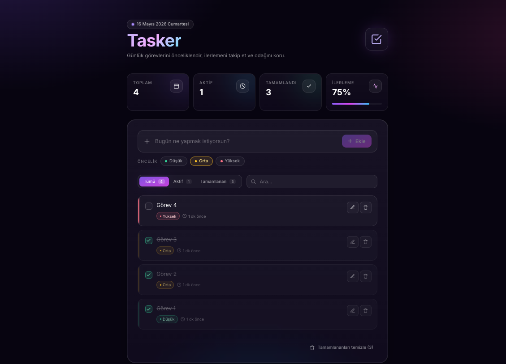

# Tasker — Modern Görev Yöneticisi

Web Geliştirme — JavaScript eğitim programı kapsamında geliştirilmiş modern bir TODO uygulaması. Koyu temalı, glassmorphism arayüzü ile günlük görevlerini önceliklendirip ilerlemeni takip edebilirsin.

## Kullanılan Teknolojiler

- **ReactJS 18** — UI kütüphanesi
- **TypeScript** — Tip güvenli geliştirme
- **Vite** — Hızlı geliştirme sunucusu ve build aracı
- **Tailwind CSS 3** — Utility-first CSS çerçevesi
- **LocalStorage** — Tarayıcı tabanlı kalıcı veri saklama
- **Inter** & **JetBrains Mono** — Modern tipografi

## Özellikler

### CRUD İşlemleri (yönerge gereği)
- **Ekle** — Yeni görev oluşturma (öncelik seçimi ile)
- **Listele** — Tüm görevleri filtrelenebilir liste halinde görüntüleme
- **Güncelle** — Mevcut görevi düzenleme (metin + öncelik)
- **Sil** — Görevi tek tıkla silme

### Ek Özellikler
- Üç seviyeli öncelik sistemi (Düşük / Orta / Yüksek) — renk kodlu
- İstatistik paneli: toplam, aktif, tamamlanan, ilerleme yüzdesi
- Filtre sekmeleri: Tümü / Aktif / Tamamlanan
- Görev arama
- Tamamlananları toplu temizleme
- Görece zaman gösterimi (`şimdi`, `5 dk önce`, `2 sa önce`)
- LocalStorage ile veri kalıcılığı
- Tam responsive (mobil & masaüstü)
- Glassmorphism + gradient + animasyonlu kart geçişleri

## Proje Yapısı

```
src/
├── components/
│   ├── FilterTabs.tsx     # Tümü / Aktif / Tamamlanan sekmeleri
│   ├── StatsPanel.tsx     # İstatistik kartları + ilerleme çubuğu
│   ├── TodoForm.tsx       # Görev ekleme formu (öncelik picker)
│   ├── TodoItem.tsx       # Tek görev kartı (düzenle/sil/tamamla)
│   └── TodoList.tsx       # Liste + boş durum
├── pages/
│   └── HomePage.tsx       # Ana sayfa, state yönetimi
├── interfaces/
│   └── ITodo.ts           # ITodo, Priority, FilterType tipleri
├── App.tsx
├── main.tsx
└── index.css              # Tailwind + global stiller
```

## Kurulum

```bash
# 1) Bağımlılıkları yükle
npm install

# 2) Geliştirme sunucusunu başlat
npm run dev

# 3) Production build
npm run build

# 4) Build'i önizle
npm run preview
```

## Canlı Demo

[Netlify Linki Buraya Eklenecek]

## Ekran Görüntüsü



## Yönerge Karşılığı

| Madde | Karşılık |
|---|---|
| Modern JS kütüphanesi | **ReactJS 18** |
| CSS çerçevesi | **Tailwind CSS 3** |
| Klasör yapısı (Components, Pages, Interfaces) | Var |
| Ekle / Listele / Güncelle / Sil | Var |
| Ekran görüntüsü | `screenshot.png` |
| GitHub public repo | https://github.com/Radowfen/todo-app |
| Netlify yayın | [Eklenecek] |

## Geliştirici
Emre Açanal
Staj Projesi · 2026
